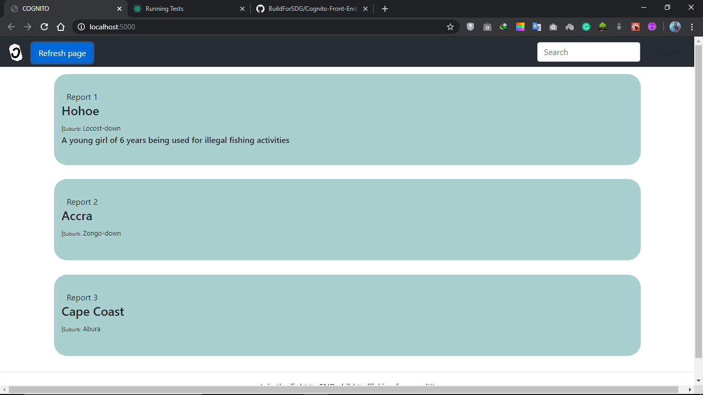

# COGNITO

**COGNITO** is a two-way app built in ReactJs, Node and Express with MongoDB as database,
that allows users to send anonymous reports on modern slavery, child trafficking and child labour to national and stakeholder authorities to ease information gathering and social policy formations.

## About

COGNITO is only but one part of the general proposed solution towards the SDG Goal 8 Problem Statement 1.
The app is currently web based and will be optimised for mobile viewing in future updates.

## Problems identified

1. Parents and children are not able to effectively spot the dangers of modern slavery, child trafficking and child labour.

2. The current mode of information dissemination to curb child trafficking by
 investigators (journalists, ministry of gender, NGO’s etc) to be primarily social media based not very effective
3. Lack of direct interaction from the victims themselves, makes it more difficult for investigators to provide support.

## Proposed solutions

1. To deal with problem 1, some parents who have their wards living with other people may have no idea of the kind of
treatment(s) being given to their wards; some also are very much aware of what is happening but
do not really know the dangers involved. When the children are able to have interaction directly
with these parents, it will bring to their realization the main events that go on, since it is coming
from a child who has experienced the situation.
The children who are rescued from child trafficking should be incorporated into the fight against
trafficking; to enhance the works of investigators. Other children who may have the intent of
indulging in such practices will also come to realize the real-life dangers involved. This text from
the problem statement “kids are unaware of what's happening, while their parents are also involved to some
extent”, means that most of the time, the children involved do not know that they are being
taken through a criminal activity (child trafficking), hence they succumb to the maltreatments
and harsh daily activities without complain.
2. The statement also pointed out the current mode of information dissemination to curb child trafficking by
investigators (journalists, ministry of gender, NGO’s etc) to be primarily social media based, the
problem statement wanted to point out that it is not enough; more avenues need to be added. Here, it is trying to tell us to create a solution that enables investigators get direct interaction
with victims and parents, thus, the victims should have an avenue where their voice will be heard.
This avenue will enable the trafficked children share their personal experiences with investigators
and other people who are ready to help fight against this abuse. The possible media to use will
include print and community outreach to create awareness and improve sensitization of locals
within the child trafficking zones on the dangers and legal issues involved. When trafficked
children are able to be given the voice, they will have more influence on parents within these
trafficking prone zones.

## Apps Built (2 APPS TO BE BUILT)

## APP 1(The reporting app; for general public)

The app will feature the ability for people to send reports anonymously of any case of child trafficking
which they are currently witnessing to the authorities. The app will allow them to share:

• City, suburb where the activity is going on, names and residential location of
perpetrators, precise/specific location eg. cocoa farm, fishing on lake Volta, or if unknown
correspondence location may be entered.
The report lodged will be sent as notification or SMS to the various stakeholders beforehand(feature to be added later).
When the stakeholders receive notifications, they can open to app to view reports lodged by
various people and also click to read more information about specific reports. This will allow swift
action of the security forces to take hold and rescue the children and prosecute perpetrators.
So, the app works like a ‘one-way messaging app’, where the general public become the ‘senders’ and
the stakeholders become the ‘receivers’.

## Author

### Brief Bio

Wilson Gbedema is a graduate of BSc Biomedical Sciences from the University of Cape Coast, Ghana.
He doubles as a Full Stack Web Developer with 4 years of experience. 
He is a lover of medicine and computer programming. His interests are in Cybersecurity and Mobile App Development.
He has skills in Python for Ethical Hacking, Javascript, jQuery, ReactJs, Node, EJS, Express, SQL and MongoDB.
He is the Lead Instructor at G-Security and TTL for Team-212.
Github profile: [https://github.com/brakweku]
Whole COGNITO project is built and managed by him.

## Contributions

Special thanks to all coders at [https://stackoverflow.com], [https://medium.com], [https://superuser.com] and [https://dev.to] for their awesome blog posts.
